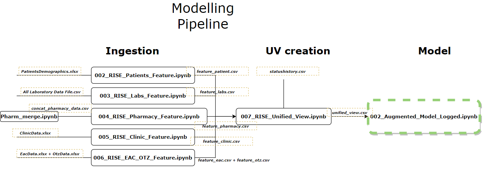

# JHUPIEGO-RISE

## Table of Contents
1. [Overview](#overview)
2. [Technologies](#technologies)
3. [Installation](#installation)
4. [Folder Structure](#folder-structure)
5. [How to Run](#how-to-run)
6. [FAQs](#faqs)
7. [Other Links and Resources](#other-links-and-resources)

## Overview
***

This repository represents work completed by [Palindrome Data](https://www.palindromedata.com/) in developing a predictive model for interruption in treatment. 
It includes data validation, exploratory data analysis, feature engineeering, and modelling. For more information check out the docs folder. 

## Technologies
***

Below is a list of the programming languages and software used:

 - **Programming Languages:** `Python > 3.6` for these notebooks `Python 3.8` was used.
 - **Logging Software:** `MLFlow`
 - **Environment and IDE:** `Anaconda Jupyter Notebooks`
 

## Installation
***
If you have not already downloaded anaconda, download it [here](https://www.anaconda.com/products/distribution)

Below are steps to create an environment (if you have not yet), install the relevant packages and create a local folder:

### Repo Download

1. If you have not cloned the repo yet, open a terminal window anaconda and use: `git clone https://github.com/RISE-NG-ML/riseng-ltfu-ml.git` to any folder on your local repo.

2. If you already have the repo on your local computer, go to the rise git repo [here](https://github.com/RISE-NG-ML/riseng-ltfu-ml) and `git pull` in you command.

3. Then run the command below to unzip the contents:
`unzip jhupiego_rise_phase1-feature-paper_stats_info.zip`

4. Then access the directory by using:
`cd jhupiego_rise_phase1-feature-paper_stats_info/`

5. Then check the contents by running:
`ls -a` for linux and `dir` for windows

### Environment Setup

1. In the terminal run `conda info -e` to check what environments are installed. 
2. If you would like to use en existing environment you use the command `conda activate <environment name>`
3. To create a new environment, run `conda create -name RISE38 python=3.8`. Then run `conda activate RISE`.
3. Run `conda list` to check the installed packages. **Note:** If you are using an existing environment (i.e.not RISE38), packages will have to be installed individually. For the newly created `RISE38` environment, in the open terminal window run
`pip install -r requirement.txt`. Then run `conda list` to check if packages are installed.

## Folder Structure
***
Below is a description of the contents in each folder.

### docs
| Folder Name     | Description | 
| :---       |    :----:   |
|Data Dictionary.pdf| Data Dictionary provided by RISE|
|DataDictionary|Data Dictionary of Expected Input|
|RISE repo|In depth description of folders and how to guides on running the  modelling pipelines.|

### notebooks

| Folder Name     | Description | 
| :---       |    :----:   | 
| 001_Validation     | This folder contains notebooks for performing validation(ensuring the correct data is being pulled) on the individual datasets.      | 
|   002_EDA |    This folder contains notebooks for performing exploratory data analysis and comparative visits and drugs pickups analysis    |
| 003_Ingestion| This folder contains notebooks for data cleaning, feature engineering and creating the unified view|
|004_Modelling|This folder  contains notebooks for experimental modelling|
|005_Risk_Segmentation|This folder contains notebooks for measuring the depth of file|
|007_Cohort_Analysis|This folder contains a notebooks for modelling IIT in Akwa Ibom.|
|profile_Reports|This folder contains a notebook for profiling data|

### src
This folder contains the hiv_support_package with module which do feature engineering, assits with eda and data cleaning.

- [**docs**](docs)
- [**notebooks**](notebooks)
    - [**001\_Validation**](notebooks/001\_Validation)
        - [001\_RISE\_Patients\_Validation.ipynb](notebooks/001\_Validation/001\_RISE\_Patients\_Validation.ipynb)
        - [002\_RISE\_Clinic\_Validation.ipynb](notebooks/001\_Validation/002\_RISE\_Clinic\_Validation.ipynb)
        - [003\_RISE\_Pharmacy\_Validation.ipynb](notebooks/001\_Validation/003\_RISE\_Pharmacy\_Validation.ipynb)
        - [004\_RISE\_Laboratory\_Validation.ipynb](notebooks/001\_Validation/004\_RISE\_Laboratory\_Validation.ipynb)
        - [005\_RISE\_Drugs\_Validation.ipynb](notebooks/001\_Validation/005\_Drugs\_Validation.ipynb)
        - [006\_RISE\_Eac\_Otz\_Validation.ipynb](notebooks/001\_Validation/006\_RISE\_Eac\_Otz\_Validation.ipynb)
    - [**002\_EDA**](notebooks/002\_EDA)
        - [001\_RISE\_Pharmacy\_Visits\_Investigation.ipynb](notebooks/002\_EDA/001\_RISE\_Pharmacy\_Visits\_Investigation.ipynb)
        - [002\_RISE\_Clinic\_Visits\_Investigation.ipynb](notebooks/002\_EDA/002\_RISE\_Clinic\_Visits\_Investigation.ipynb)
        - [003\_RISE\_Viral\_Suppression\_Analysis.ipynb](notebooks/002\_EDA/003\_RISE\_Viral\_Suppression\_Analysis.ipynb)
        - [004\_RISE\_Comparative\_Pharmacy\_Pickups_Analysis.ipynb](notebooks/002\_EDA/004\_RISE\_Comparative\_Pharmacy\_Pickups_Analysis.ipynb)
        - [004\_RISE\_Comparative\_Visits\_Aanalysis.ipynb](notebooks/002\_EDA/004\_RISE\_Comparative\_Visits\_Aanalysis.ipynb)
        - [999\_ProfileReports.ipynb](notebooks/002\_EDA/999\_ProfileReports.ipynb)
    - [**003\_Ingestion**](notebooks/003\_Ingestion)
        - [001\_RISE\_Merging\_Pharmacy.ipynb](notebooks/003\_Ingestion/001\_RISE\_Pharmacy\_Merge.ipynb)
        - [002\_RISE\_Merging\_Patients.ipynb](notebooks/003\_Ingestion/002\_Merging\_Patients.ipynb)
        - [002\_RISE\_Patients\_Feature.ipynb](notebooks/003\_Ingestion/002\_RISE\_Patients\_Feature.ipynb)
        - [003\_RISE\_Labs\_Feature.ipynb](notebooks/003\_Ingestion/003\_RISE\_Labs\_Feature.ipynb)
        - [004\_RISE\_Pharmacy\_Feature.ipynb](notebooks/003\_Ingestion/004\_RISE\_Pharmacy\_Feature.ipynb)
        - [005\_RISE\_Clinic\_Feature.ipynb](notebooks/003\_Ingestion/005\_RISE\_Clinic\_Feature.ipynb)
        - [006\_RISE\_EAC\_OTZ\_Feature.ipynb](notebooks/003\_Ingestion/006\_RISE\_EAC\_OTZ\_Feature.ipynb)
        - [007\_RISE\_Unified\_View.ipynb](notebooks/003\_Ingestion/007\_RISE\_Unified\_View.ipynb)
    - [**004\_Modelling**](notebooks/004\_Modelling)
        - [**FeatureGroups**](notebooks/004\_Modelling/FeatureGroups)
        - [**mlruns**](notebooks/004\_Modelling/mlruns)
        - [001\_Augmented\_Experiment.ipynb](notebooks/004\_Modelling/001\_Augmented\_Experiment.ipynb)
        - [002\_Augmented\_Model\_Logged.ipynb](notebooks/004\_Modelling/002\_Augmented\_Model\_Logged.ipynb)
    - [**005\_Risk_Segmentation**](notebooks/005\_Risk_Segmentation)
        - [002\_Risk\_Segmentation.ipynb](notebooks/005\_Risk\_Segmentation/002\_Risk\_Segmentation.ipynb)
    - [**007\_Cohort_Analysis**](notebooks/007\_Cohort_Analysis)
        - [**FeatureGroups**](notebooks/007\_Cohort_Analysis/FeatureGroups)
        - [**mlruns**](notebooks/007\_Cohort_Analysis/mlruns)
        - [001_Cohort Analysis_Akwa_Ibom.ipynb](notebooks/007_Cohort_Analysis/001_Cohort%20Analysis_Akwa_Ibom/.ipynb)
    - [**profile_Reports**](notebooks/profile_Reports)
    - [**Figures**](Figures)
- [**src**](src)
    - [**hiv_support_package**](src/hiv_support_package)
- [**notebooks-for-sharing**](notebooks-for-sharing)
    - [**uv_creation**](notebooks-for-sharing/uv_creation)
    - [**modelling**](notebooks-for-sharing/modelling)

Phase 2 (updated modelling) also includes: 
    - [**DataChecks**](notebooks/DataChecks)
    - [**2022_model**](notebooks/2022_model)

## How to Run
***

There are several pipelines whose main purpose is for for data validation and model building. for model building.

Below is an diagram of how to run the notebooks to produce the final predictive model:

1. Create a `<data folder>` folder on your local machine. Add this path to the `config_LTFU.yaml` file at the `raw_data_path:` sub-heading then save the config file.
2. Add the files required in the same format  to the created data folder as previously sent to palindrome. 
3. The notebooks run as ingestion -> unified view creation -> model.
- Run `001_Pharmacy_Merge.ipynb` to merge the the pharmacy data.
- Then run `002_RISE_Patients_Feature.ipynb`, then `003_RISE_Labs_Feature.ipynb`, then `004_RISE_Pharmacy_Feature.ipynb`, then `005_RISE_Clinic_Feature.ipynb` and `006_RISE_Eac_Otz_Feature.ipynb`. These will output `feature_<dataset>.csv` in the data folder created on you local drive. 
- Now run the `006_RISE_Unified_View.ipynb` notebooks which takes all thoses feature csv and merges them accordingly and outputs a `unified_view.csv`. This `unified_view.csv` is the input csv for modelling.
- Then open and run `001_Augmented_Model_Logged.ipynb` to produce the model, it's metrics and the `model.pkl` in the `mlruns` folder.
 

## FAQS
***
- [*How to download anaconda?*](https://towardsdatascience.com/anaconda-start-here-for-data-science-in-python-475045a9627)
- [*How to use MLFlow?*](https://www.mlflow.org/docs/latest/tutorials-and-examples/tutorial.html)
- *Where should I create a local data folder?* Create a data folder on your local machine outside your git repo and ensure your gitignore has included excel files and csv's so raw data is not stored in the repo. 

## Other Links and Resources
***
- [Orchestration Package](https://docs.orchest.io/en/stable/getting_started/quickstart.html#quickstart)
- [Installing packages](https://docs.conda.io/projects/conda/en/latest/user-guide/concepts/installing-with-conda.html)
